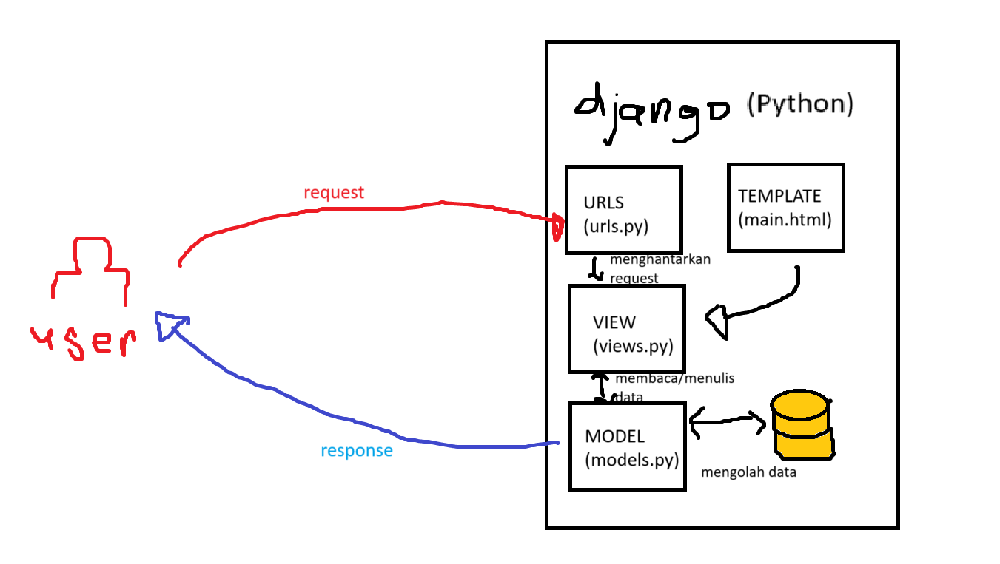
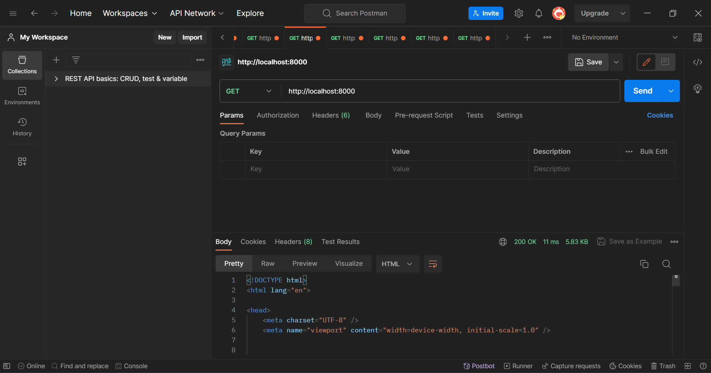
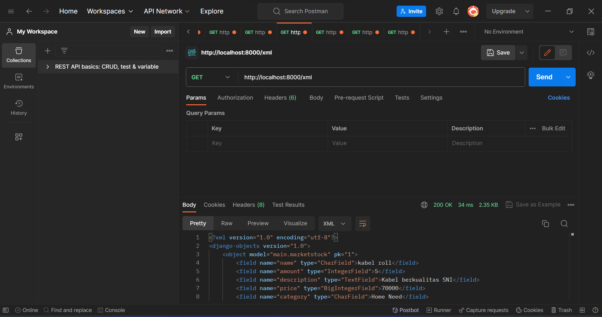
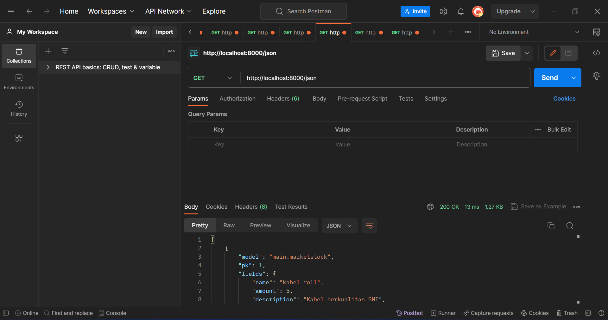
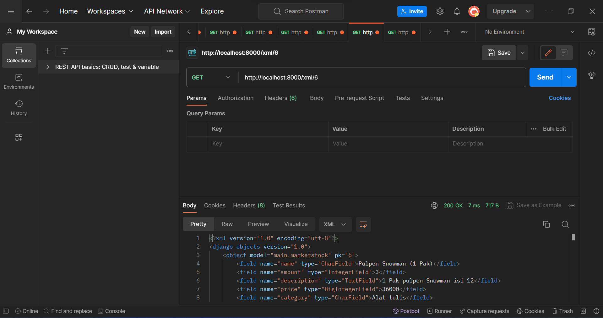
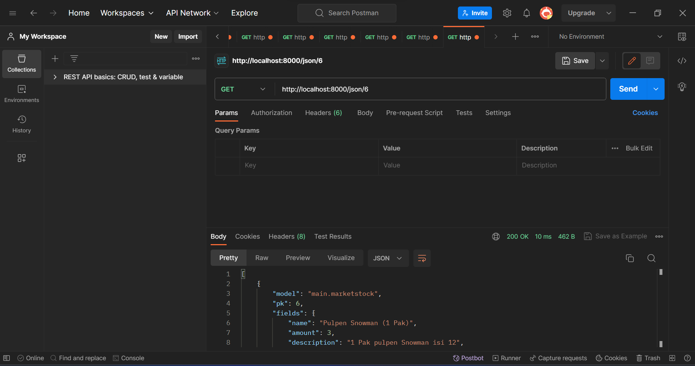
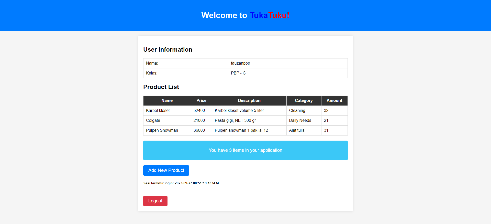
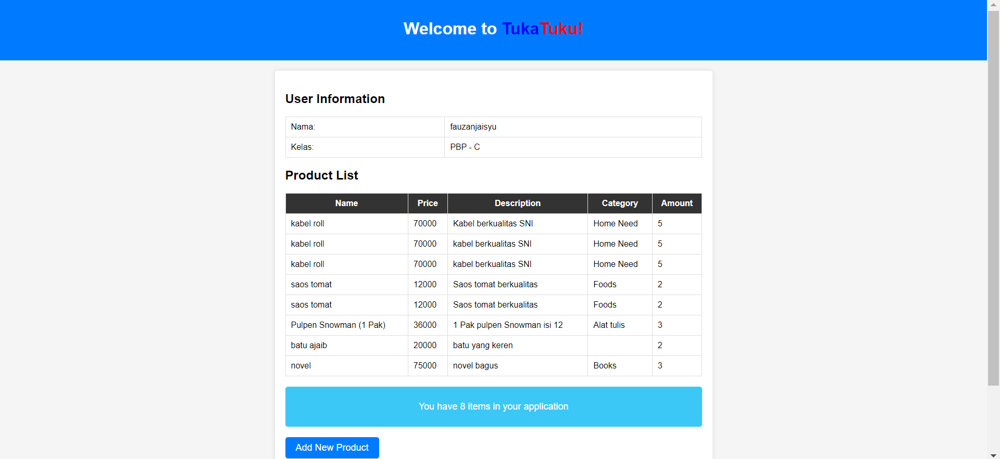

# **Market APP**

**Daftar isi :**<br/>
[Tugas 2](#tugas-2)<br/>
[Tugas 3](#tugas-3)<br/>
[Tugas 4](#tugas-4)<br/>
[Tugas 5](#tugas-5)<br/>
[Tugas 6](#tugas-6)

**Muhammad Fauzan Jaisyurrahman**<br/>
**2206814040**<br/>
**PBP C**<br/>

Tautan untuk menuju aplikasi TukaTuku dapat diakses melalui [TukaTuku](https://tukatuku-web.adaptable.app/main/).

# **Tugas 2**
## **Langkah pengerjaan tugas 2 PBP**
1. Membuat direktori bernama `tukatuku` kemudian mengksesnya pada shell
2. Membuat *virtual environment* Python untuk mengisolasi proyek Python dengan menggunakan perintah `python -m venv env`.
3. Mengaktifkan *virtual environment* dengan perintah `env\Scripts\activate.bat` (Windows) *Virtual environment* akan aktif dan ditandai dengan `(env)` di baris input terminal.
4. Membuat file `requirements.txt` di dalam direktori proyek dan isi dengan daftar *dependencies* yang dibutuhkan untuk proyek. Contoh beberapa *dependencies* yang akan digunakan sebagai berikut.
```txt
django
gunicorn
whitenoise
psycopg2-binary
requests
urllib3
```
5. Mengunduh semua *dependencies* pada `requirements.txt` dengan perintah `python -m pip install -r requirements.txt`.
6. Membuat proyek Django dengan nama `tukatuku_web` menggunakan perintah `django-admin startproject tukatuku_web .`.
7. Menambahkan `*` pada `ALLOWED_HOSTS` di dalam `settings.py` yang berada di dalam direktori `tukatuku_web` untuk mengizinkan akses dari semua host.
```python
...
ALLOWED_HOSTS = ["*"]
...
```
8. Kembali ke *command prompt* atau *terminal shell* dan jalankan server dengan perintah `python manage.py runserver` di dalam direktori proyek (pastikan ada file `manage.py` di sana). Lalu akses http://localhost:8000 di peramban web untuk melihat animasi roket yang menandakan bahwa aplikasi Django Anda telah berhasil dibuat.
9. Untuk menghentikan server, cukup dengan menekan tombol `Ctrl+C` di *command prompt* atau *terminal shell*. Pastikan juga untuk menonaktifkan *virtual environment* dengan menggunakan perintah `deactivate`.
10. Buat file `.gitignore` untuk menentukan berkas-berkas dan direktori-direktori yang harus diabaikan oleh Git. Isilah file tersebut dengan teks berikut.
```.gitignore
# Django
*.log
*.pot
*.pyc
__pycache__
db.sqlite3
media

# Backup files
*.bak 

# If you are using PyCharm
# User-specific stuff
.idea/**/workspace.xml
.idea/**/tasks.xml
.idea/**/usage.statistics.xml
.idea/**/dictionaries
.idea/**/shelf

# AWS User-specific
.idea/**/aws.xml

# Generated files
.idea/**/contentModel.xml

# Sensitive or high-churn files
.idea/**/dataSources/
.idea/**/dataSources.ids
.idea/**/dataSources.local.xml
.idea/**/sqlDataSources.xml
.idea/**/dynamic.xml
.idea/**/uiDesigner.xml
.idea/**/dbnavigator.xml

# Gradle
.idea/**/gradle.xml
.idea/**/libraries

# File-based project format
*.iws

# IntelliJ
out/

# JIRA plugin
atlassian-ide-plugin.xml

# Python
*.py[cod] 
*$py.class 

# Distribution / packaging 
.Python build/ 
develop-eggs/ 
dist/ 
downloads/ 
eggs/ 
.eggs/ 
lib/ 
lib64/ 
parts/ 
sdist/ 
var/ 
wheels/ 
*.egg-info/ 
.installed.cfg 
*.egg 
*.manifest 
*.spec 

# Installer logs 
pip-log.txt 
pip-delete-this-directory.txt 

# Unit test / coverage reports 
htmlcov/ 
.tox/ 
.coverage 
.coverage.* 
.cache 
.pytest_cache/ 
nosetests.xml 
coverage.xml 
*.cover 
.hypothesis/ 

# Jupyter Notebook 
.ipynb_checkpoints 

# pyenv 
.python-version 

# celery 
celerybeat-schedule.* 

# SageMath parsed files 
*.sage.py 

# Environments 
.env 
.venv 
env/ 
venv/ 
ENV/ 
env.bak/ 
venv.bak/ 

# mkdocs documentation 
/site 

# mypy 
.mypy_cache/ 

# Sublime Text
*.tmlanguage.cache 
*.tmPreferences.cache 
*.stTheme.cache 
*.sublime-workspace 
*.sublime-project 

# sftp configuration file 
sftp-config.json 

# Package control specific files Package 
Control.last-run 
Control.ca-list 
Control.ca-bundle 
Control.system-ca-bundle 
GitHub.sublime-settings 

# Visual Studio Code
.vscode/* 
!.vscode/settings.json 
!.vscode/tasks.json 
!.vscode/launch.json 
!.vscode/extensions.json
.history
```

## **Membuat aplikasi dengan nama `main` pada proyek**
1. Buka *command prompt* pada direktori utama dan aktifkan *virtual environment* dengan perintah `env\Scripts\activate.bat`.
2. Membuat aplikasi `main` dengan perintah `python manage.py startapp main`
3. Mendaftarkan aplikasi `main` ke proyek dengan menambahkan `'main'` pada `INSTALLED_APPS` di dalam file `settings.py`.
```python
INSTALLED_APPS = [
    ...,
    'main',
    ...
]
```
 
## **Membuat model pada aplikasi `main`**
1. Pada langkah ini, ubah file `models.py` yang terdapat di dalam direktori aplikasi `main` untuk mendefinisikan model baru dengan nama `MarketStock` dan memiliki atribut wajib sebagai berikut.
* `name` sebagai nama item dengan tipe `CharField`.
* `amount` sebagai jumlah item dengan tipe `IntegerField`.
* `description` sebagai deskripsi item dengan tipe `TextField`.<br/>
Kemudian menambahkan atribut `price` dan `category`.
2. Isi file `models.py` dengan kode berikut.
```python
from django.db import models

class MarketStock(models.Model):
    name = models.CharField(max_length=255)
    amount = models.IntegerField()
    description = models.TextField()
    price = models.BigIntegerField()
    category = models.CharField(max_length=255)
```
3. Jalankan perintah `python manage.py makemigrations` untuk membuat migrasi model lalu jalankan perintah `python manage.py migrate` untuk menerapkan migrasi ke dalam basis data lokal.

> [!IMPORTANT]
> Setiap kali melakukan perubahan pada model, seperti menambahkan atau mengubah atribut, perlu melakukan migrasi untuk merefleksikan perubahan tersebut.

## **Membuat sebuah fungsi pada `views.py` untuk dikembalikan ke dalam sebuah template HTML**
1. Buat direktori baru bernama `templates` di dalam direktori aplikasi `main` buat file `main.html` di dalamnya.
2. Buka file `views.py` pada direktori `main` dan tambahkan baris kode di paling atas `from django.shortcuts import render`. Ini akan mengimpor fungsi render dari modul django.shortcuts, yang akan digunakan untuk melakukan proses rendering tampilan HTML dengan menggunakan data yang diberikan.
3. Buat fungsi `show_stock` dengan parameter `request`. Di dalam fungsi ini, buatlah sebuah dictionary `context` yang berisi data yang akan dikirimkan ke tampilan. Setelah itu, gunakan fungsi `render` dengan tiga argumen, yaitu `request` (objek permintaan HTTP yang dikirim oleh pengguna), nama file HTML yang akan digunakan untuk me-render tampilan, dan `context` (dictionary yang berisi data untuk digunakan dalam tampilan yang dinamis). Setelah itu, kembalikan hasil rendering tersebut.
```python
from django.shortcuts import render

# Create your views here.

def show_stock(request):
    context = {
        'name': 'Buku Tulis SIDU',
        'amount': 20,
        'description' : 'Buku tulis sekolah merk SIDU',
        'price' : 5000,
        'category' : 'Book'
    }

    return render(request, "main.html", context)
```
4. Buka file `main.html` yang telah dibuat sebelumnya dan lakukan perubahan pada kode yang tadinya statis menjadi kode Django yang sesuai untuk menampilkan data. Gunakan sintaks Django `{{ }}` untuk memasukkan data dari `context` yang telah dikirimkan oleh fungsi `show_stocks`.

## **Membuat sebuah routing pada `urls.py` aplikasi main untuk memetakan fungsi yang telah dibuat pada `views.py`**
Jika belum ada, buat file `urls.py` di dalam direktori main. Konfigurasi routing URL aplikasi `main` dengan melakukan perubahan pada file `urls.py` yang berada dalam direktori `main`.
```python
from django.urls import path
from main.views import show_stock

app_name = 'main'

urlpatterns = [
    path('', show_stock, name='show_stock'),
]
```

## **Melakukan routing pada proyek agar dapat menjalankan aplikasi `main`**
Untuk menjalankan aplikasi yang dibuat perlu dilakukan konfigurasi routing proyek. Tambahkan path yang mengarah ke aplikasi tersebut di dalam file `urls.py` yang berada di dalam direktori proyek.
```python
"""
URL configuration for inventory_app project.

The `urlpatterns` list routes URLs to views. For more information please see:
    https://docs.djangoproject.com/en/4.2/topics/http/urls/
Examples:
Function views
    1. Add an import:  from my_app import views
    2. Add a URL to urlpatterns:  path('', views.home, name='home')
Class-based views
    1. Add an import:  from other_app.views import Home
    2. Add a URL to urlpatterns:  path('', Home.as_view(), name='home')
Including another URLconf
    1. Import the include() function: from django.urls import include, path
    2. Add a URL to urlpatterns:  path('blog/', include('blog.urls'))
"""
from django.contrib import admin
from django.urls import path, include

urlpatterns = [
    path('admin/', admin.site.urls),
    path('main/', include('main.urls')),
]
```

## **Melakukan deployment ke Adaptable**
1. Login [Adaptable.io](https://adaptable.io/) dengan menggunakan akun GitHub yang digunakan untuk membuat proyek.
2. Jika sudah login, silakan tekan tombol `New App`. Pilih `Connect an Existing Repository`.
3. Hubungkan [Adaptable.io](https://adaptable.io/) dengan GitHub dan pilih `All Repositories` pada proses instalasi.
4. Pilihlah repositori proyek aplikasi yang telah diunggah ke GitHub serta branch untuk deployment.
5. Pilihlah `Python App Template` sebagai template deployment.
6. Pilih `PostgreSQL` sebagai tipe basis data yang akan digunakan.
7. Sesuaikan versi Python dengan spesifikasi aplikasimu. Untuk mengeceknya, nyalakan virtual environment dan jalankan perintah `python --version`.
8. Pada bagian `Start Command` masukkan perintah `python manage.py migrate && gunicorn (main directory).wsgi`.
9. Masukkan nama aplikasi yang juga akan menjadi nama domain situs web aplikasimu.
10. Centang bagian `HTTP Listener on PORT` dan klik `Deploy App` untuk memulai proses deployment aplikasi.

## **Bagan Client Request and Response - Django**

User akan melakukan *request* HTTP aplikasi `main` dan diterima oleh *web browser*,lalu URL *mapping* dilakukan oleh `urls.py` untuk meneruskan *request* HTTP ke `views.py`. Kemudian *request* HTTP dikembalikan oleh view menjadi *response* yang berupa HTML *page. Pada proses pengembalian, view memproses data yang dibutuhkan via `models.py` dan *template* yang akan menampilkan data tersebut.

## **Penggunaan Virtual Environment**
Virtual environment digunakan untuk mengelola dependensi, menjaga kebersihan lingkungan pengembangan, dan menghindari konflik antara versi Python dan paket-paket Python yang berbeda. Ini menjadi praktik yang umum dalam pengembangan perangkat lunak Python yang bersih dan teratur. Pembuatan aplikasi web berbasis Django sangat memungkinkan. Namun, bisa saja dapat terjadi risiko konflik *dependencies* antar proyek yang menyebabkan proyek yang sedang dibangun menjadi runyam.

## **MVC, MVT, MVVM, serta perbedaan ketiganya**

MVC (Model-View-Controller), MVT (Model-View-Template), dan MVVM (Model-View-ViewModel) adalah tiga pola desain (design patterns) yang umum digunakan dalam pengembangan perangkat lunak, terutama dalam pengembangan aplikasi berbasis web. Mereka membantu dalam mengatur dan memisahkan komponen-komponen aplikasi untuk meningkatkan keterbacaan, skalabilitas, dan pemeliharaan.

1.MVC (Model-View-Controller)

Controller : Perantara antara Model dan View. Controller menerima input dari pengguna melalui View, memprosesnya, berinteraksi dengan Model untuk mengambil atau memodifikasi data, dan kemudian memperbarui tampilan (View) sesuai dengan hasilnya 

2.MVT (Model-View-Template)

Template : Komponen unik dari MVT yang mengurus bagian presentasi tampilan, seperti HTML. Template berisi markup HTML dengan kode templat yang akan diisi dengan data dari Model

3.MVVM (Model-View-ViewModel)

ViewModel : Komponen unik dari MVVM yang berfungsi sebagai perantara antara Model dan View. ViewModel mengambil data dari Model dan memprosesnya menjadi bentuk yang dapat langsung ditampilkan oleh View. ViewModel juga berisi logika yang terkait dengan tampilan

Tabel perbedaan ketiga pola ini

| **MVC** | **MVT** | **MVVM** |
| --- | --- | --- |
| Input diterima langsung oleh Controller | Input diterima langsung oleh put diterima langsung oleh View | Input diterima langsung oleh put diterima langsung oleh View |
| View dan Controller memiliki relasi many-to-many | View dan Template memiliki relasi one-to-one | View dan ViewModel memiliki relasi one-to-many |
| View bertanggung jawab terhadap Model yang akan diteruskan | View tidak bertanggung jawab terhadap Model, Template yang akan memperbarui Model | View tidak bertanggung jawab terhadap Model, ViewModel yang akan memperbarui View |

# **Tugas 3**
## **Langkah pengerjaan tugas 3 PBP (Implementasi *Data Delivery*)**

### Membuat input `form`

1. Pertama, membuat berkas baru `forms.py` pada direktori `main` serta menambahkan kode berikut.

    ```python
    from django.forms import ModelForm
    from main.models import MarketStock

    class ProductForm(ModelForm):
        class Meta:
            model = MarketStock
            fields = ["name", "price", "description", "amount"]
    ```


2. Kedua, mengubah fungsi `show_stock` pada `views.py` dengan kode berikut.

    ```python
    def show_stock(request):
        products = MarketStock.objects.all()

        context = {
            'name' : 'Muhammad Fauzan Jaisyurrahman',
            'class' : 'PBP - C',
            'products' : products,
        }

        return render(request, "main.html", context)
    ```

### Menambahkan fungsi pada `views` dan membuat routing URL

Membuat fungsi untuk melihat atau mengembalikan data yang telah dimasukkan melalui `form`. Sebelum membuat fungsi baru pada views tambahkan beberapa *import* berikut.

```py
from django.shortcuts import render
from django.http import HttpResponseRedirect, HttpResponse
from main.forms import ProductForm
from django.urls import reverse
from main.models import MarketStock
from django.core import serializers
```

#### **Format HTML**

1. pertama,  buat fungsi baru bernama `create_product` dengan parameter `request` dan sertakan kode berikut.

    ```python
    def create_product(request):
    form = ProductForm(request.POST or None)

    if form.is_valid() and request.method == "POST":
        form.save()
        return HttpResponseRedirect(reverse('main:show_stock'))

    context = {'form': form}
    return render(request, "create_product.html", context)

    ```

2. Membuat berkas HTML baru (*template create product*) dengan nama `create_product.html` pada direktori `main/templates`.
    ```HTML
     

    
    <h1>Add New Product</h1>

    <form method="POST">
        
        <table>
            {{ form.as_table }}
            <tr>
                <td></td>
                <td>
                    <input type="submit" value="Add Product"/>
                </td>
            </tr>
        </table>
    </form>

    
    ```

3. Menampilkan barang-barang yang tersedia dalam bentuk tabel serta membuat tombol `Add New Product` pada `main.html`.

    ```HTML
    h2 class="section-title">Product List</h2>
        <table>
            <tr>
                <th>Name</th>
                <th>Price</th>
                <th>Description</th>
                <th>Category</th>
                <th>Amount</th>
            </tr>

             Berikut cara memperlihatkan data produk di bawah baris ini 

            
                <tr>
                    <td>{{ product.name }}</td>
                    <td>{{ product.price }}</td>
                    <td>{{ product.description }}</td>
                    <td>{{ product.category }}</td>
                    <td>{{ product.amount }}</td>
                </tr>
            
        </table>

        <div class="total-item">
            <p>You have {{ products|length }} items in your application</p>
        </div>

        <a href="" class="add-product-btn">Add New Product</a>
    </div>
    ```

#### **Format XML**

Tambahkan fungsi `show_xml` dengan parameter `request` yang me-return `HttpResponse` berisi data yang sudah di-serialize menjadi XML.

```py
def show_xml(request):
    data = MarketStock.objects.all()
    return HttpResponse(serializers.serialize("xml", data), content_type="application/xml")
```

#### **Format JSON**

Tambahkan fungsi `show_json` dengan parameter `request` yang me-return `HttpResponse` berisi data yang sudah di-serialize menjadi JSON.

```py
def show_json(request):
    data = MarketStock.objects.all()
    return HttpResponse(serializers.serialize("json", data), content_type="application/json")
```

#### **Format XML *by* ID**

Tambahkan fungsi `show_xml_by_id` dengan parameter `request` yang me-return `HttpResponse` berisi data yang sudah di-serialize.

```py
def show_xml_by_id(request, id):
    data = MarketStock.objects.filter(pk=id)
    return HttpResponse(serializers.serialize("xml", data), content_type="application/xml")
```

#### **Format JSON *by* ID**

Tambahkan fungsi `show_json_by_id` dengan parameter `request` yang me-return `HttpResponse` berisi data yang sudah di-serialize.

```py
def show_json_by_id(request, id):
    data = MarketStock.objects.filter(pk=id)
    return HttpResponse(serializers.serialize("json", data), content_type="application/json")
```

Setelah pembuatan fungsi `show` selesai, buat routingnya dengan menambahkan path pada `urlpattern` di dalam berkas `urls.py`.

```py
from django.urls import path
from main.views import show_stock, create_product, show_xml, show_json, show_json_by_id, show_xml_by_id

app_name = 'main'

urlpatterns = [
    path('', show_stock, name='show_stock'),
    path('create-product', create_product, name='create_product'),
    path('xml/', show_xml, name='show_xml'), 
    path('json/', show_json, name='show_json'),
    path('xml/<int:id>/', show_xml_by_id, name='show_xml_by_id'),
    path('json/<int:id>/', show_json_by_id, name='show_json_by_id'), 
]
```

Input form sudah selesai dibuat dan siap digunakan. Jalankan command `python manage.py runserver` dan kunjungi http://localhost:8000 mencobanya.

## ***Screenshoot* Postman**

Berikut adalah *screenshoot* hasil mengakses kelima URL melalui Postman

1. HTML
    
2. XML
    
3. JSON
    
4. XML *by* ID
    
5. JSON *by* ID
    

## **Perbedaan antara form `POST` dan form `GET` dalam Django**

Di Django, `POST` dan `GET` adalah dua metode HTTP yang digunakan untuk mengirim data dari browser ke server. Kedua metode ini memiliki peran dan karakteristik yang berbeda.

| Perbedaan | `POST` | `GET` |
| -- | -- | -- |
| Penggunaan Utama | Digunakan untuk mengirim data ke server, terutama ketika ingin mengirim data yang bersifat sensitif dan mempengaruhi status server | Digunakan untuk mengambil data dari server, terutama ketika ingin mengambil data tanpa mempengaruhi status server |
| Pengiriman Data | Data yang dikirim tidak terlihat di URL | Data yang dikirm terlihat dalam URL |
| Keamanan | Lebih aman untuk mengirim data sensitif | Kurang aman untuk data sensitif |

## **Perbedaan utama antara XML, JSON, dan HTML dalam konteks pengiriman data**

| Perbedaan | XML | JSON | HTML |
|--|--|--|--|
| Tujuan Utama | XML digunakan untuk pertukaran data antara berbagai sistem dan platform. XML sering digunakan dalam layanan web, konfigurasi file, dan pertukaran data yang kompleks | JSON digunakan untuk pertukaran data di antara aplikasi web dan server. Ini telah menjadi format yang sangat populer untuk API web RESTful karena kemudahan penggunaannya dan pembacaan manusia yang mudah | HTML digunakan untuk membuat tampilan dan struktur halaman web yang dapat ditampilkan oleh peramban web |

## **Alasan mengapa JSON sering digunakan dalam pertukaran data antara aplikasi web modern**
Berikut adalah kelebihan penggunaan JSON dalam pertukaran data:
1. Ringkas dan Mudah Dibaca: JSON adalah format yang ringkas dan mudah dibaca oleh manusia. Strukturnya terdiri dari pasangan "kunci-nilai" yang membuatnya mudah dipahami dan diinterpretasi oleh pengembang. Karena kemudahan keterbacaannya, JSON membuat proses pengembangan dan debugging lebih mudah.

2. Struktur Data yang Fleksibel: JSON mendukung struktur data yang sangat fleksibel, termasuk larik, objek bersarang, dan tipe data primitif. Ini memungkinkan Anda untuk mewakili data dengan tingkat kompleksitas yang berbeda, sehingga sesuai untuk berbagai jenis aplikasi web.

3. Lintas Platform dan Browser: JSON dapat digunakan di berbagai platform dan didukung oleh sebagian besar peramban web modern. Ini memastikan bahwa data dalam format JSON dapat diakses oleh berbagai jenis perangkat dan sistem operasi.

# **Tugas 4**
## **Langkah pengerjaan tugas 4 PBP (melakukan implementasi konsep authentication, session, cookies)**

### **Mengimplementasikan fungsi registrasi, login, dan logout untuk memungkinkan pengguna untuk mengakses aplikasi sebelumnya, menghubungkan model `Item` dengan `User`, menampilkan detail informasi pengguna yang sedang logged in seperti username dan menerapkan `cookies` seperti `last login` pada halaman utama aplikasi**

1. Aktifkan *Python virtual environment.*

2. Import beberapa modul berikut pada `views.py` pada `main`.

    ```py
    import datetime
    from django.contrib.auth.decorators import login_required
    from django.contrib.auth.forms import UserCreationForm
    from django.contrib.auth import authenticate, login, logout
    from django.contrib import messages
    from django.shortcuts import render, redirect
    from django.core import serializers
    from django.http import HttpResponse
    from django.http import HttpResponseRedirect
    from django.urls import reverse
    from main.forms import ProductForm
    from main.models import InventoryItem
    ```

3. Buat fungsi `register`, `login`, `logout` dengan parameter `request`, serta menambahkan kode pada fungsi `show_stock` dan `create_product`.

    Tambahkan fungsi berikut:

    ```py
    def register(request):
    form = UserCreationForm()

    if request.method == "POST":
        form = UserCreationForm(request.POST)
        if form.is_valid():
            form.save()
            messages.success(request, 'Your account has been successfully created!')
            return redirect('main:login')
    context = {'form':form}
    return render(request, 'register.html', context)

    def login_user(request):
        if request.method == 'POST':
            username = request.POST.get('username')
            password = request.POST.get('password')
            user = authenticate(request, username=username, password=password)
            if user is not None:
                login(request, user)
                response = HttpResponseRedirect(reverse("main:show_stock")) 
                response.set_cookie('last_login', str(datetime.datetime.now()))
                return response
            else:
                messages.info(request, 'Sorry, incorrect username or password. Please try again.')
        context = {}
        return render(request, 'login.html', context)

    def logout_user(request):
        logout(request)
        response = HttpResponseRedirect(reverse('main:login'))
        response.delete_cookie('last_login')
        return response
    ```

    Ubah `show_stock` dan `create_product`

    ```py
    @login_required(login_url='/login')
    def show_stock(request):
        products = MarketStock.objects.filter(user=request.user)

        context = {
            'name' : request.user.username,
            'class' : 'PBP - C',
            'products' : products,
            'last_login' : request.COOKIES['last_login'],
        }

        return render(request, "main.html", context)

    def create_product(request):
        form = ProductForm(request.POST or None)

        if form.is_valid() and request.method == "POST":
            product = form.save(commit=False)
            product.user = request.user
            product.save()
            return HttpResponseRedirect(reverse('main:show_stock'))

        context = {'form': form}
        return render(request, "create_product.html", context)

    ``` 


4. Membuat berkas `register.html`, `login.html` serta menambahkan tombol `logout` pada `main.html`. Serta menambahkan tampilan 'sesi terakhir login'.


    Isi berkas `register.html`.

    ```HTML
    

    
        <title>Register</title>
    

      

    <div class = "login">
    
    <h1>Register</h1>  

        <form method="POST" >  
              
            <table>  
                {{ form.as_table }}  
                <tr>  
                    <td></td>
                    <td><input type="submit" name="submit" value="Daftar"/></td>  
                </tr>  
            </table>  
        </form>

      
        <ul>   
              
                <li>{{ message }}</li>  
                  
        </ul>   
    

    </div>  

    
    ```

    Isi berkas `login.html`

    ```HTML
    

    
        <title>Login</title>
    

    
    <style>
        
        .center {
            display: flex;
            justify-content: center; /* Mengatur posisi horizontal tengah */
            align-items: center; /* Mengatur posisi vertikal tengah */
            height: 100vh; /* Mengisi tinggi ke seluruh tinggi layar */
        }

        .login {
            width: 300px;
            padding: 20px;
            background-color: #f5f5f5;
            border: 1px solid #ccc;
            border-radius: 5px;
            box-shadow: 0 0 10px rgba(0, 0, 0, 0.2);
            font-family: Arial, sans-serif;
        }

        .login h1 {
            text-align: center;
            color: #333;
        }

        .login table {
            width: 100%;
        }

        .login td {
            padding: 10px;
        }

        .login .form-control {
            width: 100%;
            padding: 10px;
            margin-bottom: 10px;
            border: 1px solid #ccc;
            border-radius: 3px;
        }

        .login .btn {
            background-color: #007bff;
            color: #fff;
            padding: 10px 20px;
            border: none;
            border-radius: 3px;
            cursor: pointer;
        }

        .login .btn:hover {
            background-color: #0056b3;
        }

        .login .error-messages {
            color: red;
            list-style-type: none;
            padding: 0;
            text-align: center;
        }

        .login a {
            text-decoration: none;
            color: #007bff;
        }

        .login a:hover {
            text-decoration: underline;
        }

        .centered-text {
            text-align: center;
        }
    </style>

    <!-- Memasukkan kotak login ke dalam div untuk mengatur tata letak -->
    <div class="center">
        <div class="login">
            <h1>Login</h1>

            <form method="POST" action="">
                
                <table>
                    <tr>
                        <td>Username: </td>
                        <td><input type="text" name="username" placeholder="Username" class="form-control"></td>
                    </tr>
                            
                    <tr>
                        <td>Password: </td>
                        <td><input type="password" name="password" placeholder="Password" class="form-control"></td>
                    </tr>

                    <tr>
                        <td></td>
                        <td><input class="btn" type="submit" value="Login"></td>
                    </tr>
                </table>
            </form>

            
                <ul class="error-messages">
                    
                        <li>{{ message }}</li>
                    
                </ul>
                 
            
            <p class="centered-text">Don't have an account yet? <a href="">Hit me!</a></p>
        </div>
    </div>

    
    ```

    Tambahkan tombol `logout` pada `main.html`.
    ```HTML
    ...
    <!-- Logout button -->
        <a href="" class="logout-btn">Logout</a>
    ...
    ```

    Pada `main.html` tambahkan potongan kode berikut untuk menambahkan tampilan 'sesi terakhir login'
    ```HTML
    ...
    <h5>Sesi terakhir login: {{ last_login }}</h5>
    ...
    ```

## **Membuat dua akun *dummy* dan masing-masing tiga item *dummy***

1. Username : fauzanpbp

    

2. Username : fauzanjaisyu

    


## **Apa itu Django `UserCreationForm`,dan apa saja kelebihan dan kekurangannya**
`django.contrib.auth.forms.UserCreationForm` adalah sebuah formulir bawaan Django yang digunakan untuk membuat formulir pendaftaran pengguna (user registration form) dalam aplikasi web Anda. Formulir ini menyediakan berbagai bidang yang umumnya diperlukan untuk mendaftarkan pengguna baru, seperti nama pengguna (username), kata sandi (password), dan konfirmasi kata sandi (password confirmation). Ini adalah salah satu komponen dari sistem autentikasi yang kuat yang disediakan oleh Django.

|Kelebihan|Kekurangan|
|--|--|
|Mudah Digunakan: UserCreationForm adalah komponen yang sudah jadi dan siap pakai dalam Django. Ini memungkinkan Anda membuat formulir pendaftaran pengguna dengan cepat tanpa harus menulis kode formulir dari awal.|Keterbatasan dalam Kasus Penggunaan Khusus: Terkadang, aplikasi web mungkin memiliki kebutuhan yang lebih kompleks untuk pendaftaran pengguna daripada yang ditangani oleh UserCreationForm. Dalam kasus-kasus seperti itu, Anda mungkin perlu menulis formulir pendaftaran kustom Anda sendiri.|
|Terintegrasi dengan Django Authentication: Formulir ini terintegrasi dengan baik dengan sistem autentikasi Django. Ini akan menangani validasi kata sandi, pengulangan kata sandi, serta penyimpanan data pengguna ke dalam basis data.|Tidak Otomatis Menyertakan Bidang Tambahan: Jika Anda perlu menyertakan bidang tambahan dalam pendaftaran pengguna (misalnya, alamat, nomor telepon, atau foto profil), Anda harus menyesuaikan formulir ini secara manual.|

## **Perbedaan antara autentikasi dan otorisasi dalam konteks Django, dan mengapa keduanya penting**

Autentikasi dan otorisasi adalah dua konsep yang sangat penting dalam konteks pengembangan web, termasuk dalam kerangka kerja Django. Keduanya adalah bagian integral dari sistem keamanan yang memastikan bahwa pengguna memiliki akses yang sesuai ke berbagai bagian dari aplikasi web Anda, tetapi masing-masing memiliki peran yang berbeda.

|   |Autentikasi|Otorisasi|
|--|--|--|
|Arti|Autentikasi adalah proses verifikasi identitas pengguna. Ini adalah cara untuk memastikan bahwa seseorang adalah orang yang mereka klaim.|Otorisasi adalah proses menentukan hak akses apa yang dimiliki pengguna setelah mereka diotentikasi. Ini menentukan apa yang dapat dan tidak dapat diakses oleh pengguna tertentu dalam aplikasi.|
|Dalam konteks Django|Django menyediakan sistem autentikasi yang memungkinkan pengguna untuk mendaftar, masuk, dan mengelola akun mereka. Ini termasuk verifikasi kata sandi, penyimpanan informasi pengguna, dan lainnya.|Django menyediakan sistem otorisasi yang berbasis pada model pengguna (User) dan grup pengguna (Group). Anda dapat mengatur hak akses pengguna ke berbagai bagian dari aplikasi Anda menggunakan izin.|
|Kegunaan| Autentikasi penting untuk memastikan bahwa hanya pengguna yang sah yang memiliki akses ke aplikasi Anda. Ini mencegah orang yang tidak sah mengakses data atau fungsi yang seharusnya hanya tersedia untuk pengguna yang sah.|Otorisasi memastikan bahwa pengguna hanya dapat melihat atau mengubah data yang sesuai dengan peran atau izin mereka dalam aplikasi. Ini membantu melindungi data sensitif dan mengelola tingkat akses pengguna.|

## ***Cookies* dalam konteks aplikasi web, dan bagaimana Django menggunakan *cookies* untuk mengelola data sesi pengguna**

Cookies adalah potongan kecil data yang disimpan di sisi klien (misalnya, di browser web) dan digunakan dalam konteks aplikasi web untuk menyimpan informasi terkait sesi pengguna atau preferensi. Cookies biasanya berisi data dalam bentuk teks, dan mereka digunakan oleh aplikasi web untuk mengidentifikasi pengguna, menyimpan preferensi, dan melacak informasi lainnya terkait sesi pengguna. Dalam konteks Django, cookies sering digunakan untuk mengelola data sesi pengguna.

Django menggunakan cookies untuk mengelola data sesi pengguna melalui modul `django.contrib.sessions.middleware.SessionMiddleware`. Berikut adalah langkah-langkah umum bagaimana Django mengelola data sesi pengguna menggunakan cookies:

* Membuat atau Memeriksa Sesi: Ketika pengguna mengakses situs web Anda, Django akan membuat atau memeriksa sesi pengguna. Sesinya mungkin berisi informasi seperti ID pengguna yang terotentikasi atau preferensi pengguna.

* Penyimpanan Data Sesi: Django akan menyimpan data sesi pengguna di server, dan ID sesi ini akan dienkripsi. Data sesi sebenarnya tidak akan disimpan dalam cookies, tetapi hanya ID sesi yang akan dikirimkan ke browser pengguna.

* Cookie Sesesi: Django akan mengirimkan ID sesi ke browser pengguna dalam bentuk cookie. Cookie ini akan disimpan di browser pengguna.

* Permintaan Selanjutnya: Ketika pengguna melakukan permintaan selanjutnya ke situs web Anda, browser akan mengirimkan cookie sesi bersama dengan permintaan. Django kemudian akan membaca cookie ini dan mencocokkannya dengan sesi yang sesuai di server.

* Akses Data Sesi: Setelah sesi ditemukan, Django dapat mengakses data sesi pengguna yang sesuai. Ini memungkinkan Anda untuk menyimpan dan mengambil data yang berhubungan dengan pengguna selama sesi berlangsung.

## **Keamanan penggunaan *cookies* secara *default***

Penggunaan cookies dalam pengembangan web bergantung pada bagaimana cookies digunakan dalam konteks aplikasi web Anda dan bagaimana Anda mengelolanya. Cookies adalah alat yang sangat berguna untuk mengelola sesi pengguna dan menyimpan data sederhana di sisi klien, tetapi juga memiliki potensi risiko yang perlu diwaspadai. Berikut adalah beberapa risiko potensial yang harus diwaspadai terkait penggunaan cookies:

* Cross Site Scripting (XSS) - Penyerang memasukkan skrip berbahaya dalam cookie, yang akan dieksekusi oleh browser pengguna

* Cross-Site Request Forgery (CSRF) adalah serangan keamanan pada aplikasi web yang bertujuan untuk memanipulasi pengguna agar melakukan tindakan yang tidak diinginkan atau tidak disadari tanpa persetujuan mereka.

# **Tugas 5**

## **Penggunaan *element selector* dan waktu penggunaannya**

*Element selector* digunakan untuk merapikan tampilan html. *Element selector* memungkinkan penggunan untuk menerapkan *styling* pada beberapa elemen HTML tertentu. *Element selector* yang saya gunakan untuk memberi warna pada elemen-elemen tertentu dan untuk mengatur posisi elemen-elemen tersebut. Waktu penggunaan *Element selector* yang tepat adalah ketika digunakan untuk menghias elemen-elemen HTML dasar seperti misal judul, daftar, paragraf. *Element selector* juga digunakan ketika ingin menghapus gaya bawaan browser.

## **Tentang HTML5 Tag**

HTML5 merupakan singkatan dari *HyperText Markup Language 5*. HTML5 bukanlah sebuah bahasa pemrograman, melainkan bahasa markup. HTML5 adalah standar yang digunakan untuk mendefinisikan struktur dan konten dari halaman web yang berfungsi untuk mengatur elemen-elemen seperti teks, gambar, tautan, dan konten lainnya yang akan ditampilkan di browser.

## **Perbedaan *margin* dengan *padding***

*Margin* adalah ruang yang berada di luar batas elemen, *margin* merupakan jarak antara elemen dengan elemen-elemen lain di sekitarnya. Sedangkan *Padding* adalah ruang yang berada di dalam batas elemen, antara batas elemen dan kontennya.

|*Margin*|*Padding*|
|--|--|
|Margin mengontrol jarak antara elemen dengan elemen-elemen lain di sekitarnya (termasuk elemen-elemen lain di dalam kontainer yang sama).|Padding mengontrol jarak antara batas elemen dan kontennya. Ini mempengaruhi tampilan elemen dan dapat memiliki latar belakang atau warna.|
|Margin tidak memiliki latar belakang atau warna. Itu hanya mengatur jarak antara elemen dengan elemen-elemen lain di sekitarnya.|Padding mempengaruhi tampilan elemen itu sendiri dan dapat memiliki latar belakang atau warna. Ini adalah ruang di mana konten atau teks elemen berada.|

## **Perbedaan *framework* CSS Tailwind dan Bootstrap. Serta waktu penggunaan yang tepat**

CSS Tailwind dan Bootstrap adalah dua kerangka kerja CSS yang digunakan untuk mengembangkan tampilan dan tata letak halaman web. Keduanya memiliki pendekatan yang berbeda dalam cara mereka melakukan pengembang untuk merancang dan mengelola tampilan situs web.

| |Tailwind|Bootstrap|
|--|--|--|
|Segi pendekatan desain|Tailwind mengikuti pendekatan "utility-first" yang memberikan fleksibilitas tinggi tetapi dapat memerlukan waktu lebih lama untuk membangun desain dari nol.|Bootstrap menyediakan komponen-komponen siap pakai yang memungkinkan Anda membangun desain lebih cepat.|
|Ukuran file|Tailwind umumnya menghasilkan ukuran berkas yang lebih kecil karena hanya menggunakan kelas yang benar-benar diperlukan.|Bootstrap mungkin memiliki ukuran berkas yang lebih besar karena banyaknya komponen dan gaya yang telah ada.|

### **Kapan waktu penggunaannya?**
Penggunaan Tailwind dan Bootstrap tergantung pada pandangan pribadi dan kebutuhan proyek. Tailwind lebih cocok digunakan pada proyek yang memerlukan tingkat kustomisasi yang tinggi dan memerlukan tata letak komponen yang lebih unik. Sedang Bootstrap lebih cocok untuk proyek-proyek yang membutuhkan desain cepat dengan komponen bawaan yang telah ada.

## **Langkah-langkah pengimplementasian pengerjaan**

Untuk pengaturan tampilan agar web memiliki *Responsive Web Design*, tambahkan potongan kode berikut pada `templates/base.html` 

```HTML

            <meta charset="UTF-8" />
            <meta name="viewport" content="width=device-width, initial-scale=1">
        
```

Kemudian menggunakan CSS *Element Selector* untuk memperindah tampilan, misal *Element Selector* pada `main.html`

```HTML
 body {
            font-family: Arial, sans-serif;
            background-color: #f5f5f5;
            margin: 0;
            padding: 0;
        }
```

lalu mengubah tampilan produk menggunakan card

```HTML
<div class="card-body">
                    <h5 class="card-title">{{ product.name }}</h5>
                    <p class="card-text">Price: ${{ product.price }}</p>
                    <p class="card-text">{{ product.description }}</p>
                    <p class="card-text">Category: {{ product.category }}</p>
                    <p class="card-text">Amount: {{ product.amount }}</p>
                </div>
```

# **Tugas 6**

## **Perbedaan antara *asynchronous* programming dengan *synchronous* programming**

*Asynchronous Programming* adalah paradigma pemrograman di mana tugas-tugas dapat berjalan secara bersamaan tanpa harus menunggu respon dari task yang lain.*Asynchronous Programming* berguna dalam situasi seperti mengakses jaringan atau I/O yang lambat.

*Synchronous Programming* adalah paradigma pemrograman di mana tugas-tugas dieksekusi satu per satu dalam urutan tertentu. Setiap operasi harus menunggu operasi sebelumnya selesai sebelum melanjutkan. Cara ini memungkinkan eksekusi yang lebih terstruktur, tetapi bisa mengakibatkan program menjadi lambat jika ada tugas yang memakan waktu lama.

|*Async*|*Sync*|
|--|--|
|Multi-thread, yang berarti operasi atau program dapat berjalan secara paralel|Single-thread, sehingga hanya satu operasi atau program yang akan berjalan pada satu waktu|
|Non-blocking, yang berarti ia akan mengirimkan beberapa permintaan ke server|Blocking,yang berarti ia hanya akan mengirimkan server satu permintaan pada satu waktu dan menunggu permintaan tersebut dijawab oleh server|

## **Paradigma *event-driven programming* dan penerapannya**

Paradigma *event-driven programming* adalah pendekatan pemrograman di mana eksekusi program didasarkan pada kejadian atau tindakan yang terjadi. Pada paradigma ini, program menunggu dan merespons kejadian-kejadian yang terjadi, seperti tindakan pengguna, permintaan jaringan, atau perubahan status. Ini sering digunakan dalam pemrograman web untuk mengatasi tindakan pengguna, seperti mengklik tombol atau mengisi formulir, serta dalam komunikasi dengan server melalui AJAX. Dan contoh penerapan *event-driven programming* saya pada tugas 6 ini adalah pada penggunaan tombol 'Add Product by AJAX'.

## **Penerapan *asynchronous programming* pada AJAX** 

Asynchronous JavaScript and XML (AJAX) adalah pendekatan dalam pemrograman web yang memanfaatkan asynchronous programming (pemrograman asinkron) untuk mengirim dan menerima data dari server tanpa harus memuat ulang seluruh halaman web. Contoh penerapan *asynchronous programming* AJAX pada program saya terdapat ketika:

* Menggunakan fetch untuk mengambil data produk dari server secara asinkron menggunakan `getProducts` dan kemudian merespons data yang diterima dengan `refreshProducts`
* Memperbarui tampilan produk dalam elemen dengan id "product_row" setelah menerima respons dari server. Hal ini memungkinkan penambahan dan penghapusan produk dari daftar produk tanpa perlu memuat ulang seluruh halaman
* Menggunakan asynchronous programming untuk menambahkan produk baru. Ketika tombol "Add Product by AJAX" diklik, program akan mengirim permintaan POST ke server dan kemudian memperbarui tampilan produk setelah operasi ini selesai

## **Perbandingan antara Fetch API dan library jQuery, dan teknologi manakah yang lebih baik untuk digunakan**

Beberapa perbedaannya adalah sebagai berikut

|Kebutuhan|FetchAPI|jQuery|
|--|--|--|
|Kompatibilitas|Karena FetchAPI adalah standar modern, maka beberapa browser lama mungkin tidak mendukung secara utuh|Dirancang untuk kompatibel lintas browser|
|Standar library|Standar bawaan pada JavaScript modern, tidak memerlukan pustaka eksternal|Memerlukan library jQuery yang harus dimuat sebagai file eksternal|
|Ukuran file|Lebih ringan dan efisien untuk permintaan AJAX sederhana. Karena tidak memiliki komponen tambahan seperti jQuery|Lebih besar dan mungkin berat karena memerlukan library tambahan|

Lebih baik yang mana? tergantung
* Jika ingin membuat proyek baru dengan ukuran file yang lebih kecil, mudah dan efisien maka cocok dengan FetchAPI
* Jika ingin memerlukan kompatibilitas lintas browser yang kuat, maka jQuery lebih baik

## **Langkah-langkah pengimplementasian pengerjaan**

### Penggunaan AJAX GET dan AJAX POST
1. Membuat fungsi `get_product_json` dan `add_product_ajax` pada `views.py`
    ```py
        def get_product_json(request):
        product_item = MarketStock.objects.filter(user=request.user)
        return HttpResponse(serializers.serialize('json', product_item))

        @csrf_exempt
        def add_product_ajax(request):
            if request.method == 'POST':
                name = request.POST.get("name")
                price = request.POST.get("price")
                description = request.POST.get("description")
                amount = request.POST.get("amount")
                category = request.POST.get("category")
                user = request.user

                new_product = MarketStock(name=name, price=price, description=description,
                                        user=user, amount = amount, category = category)
                new_product.save()

                return HttpResponse(b"CREATED", status=201)
            return HttpResponseNotFound()
    ```
2. Menambahkan urlnya pada `urls.py`
    ```py
        path('get-item/', get_product_json, name='get_product_json'),
        path('create-ajax/', add_product_ajax, name='add_product_ajax'),
    ```
3. Menambahkan script AJAX pada akhir `main.html` untuk melakukan AJAX GET dan POST

    ```js
        <script>
        async function getProducts() {
            return fetch("").then((res) => res.json())
        }

        async function refreshProducts() {
            const products = await getProducts();
            const productRow = document.getElementById("product_row");
            productRow.innerHTML = ""; // Clear the existing content

            products.forEach((item) => {
                const cardDiv = document.createElement("div");
                cardDiv.className = "col-md-4";

                cardDiv.innerHTML = `
                    <div class="card mb-4">
                        <div class="card-body">
                            <h5 class="card-title">${item.fields.name}</h5>
                            <p class="card-text">Price: ${item.fields.price}</p>
                            <p class="card-text">${item.fields.description}</p>
                            <p class="card-text">Category: ${item.fields.category}</p>
                            <p class="card-text">Amount: ${item.fields.amount}</p>
                        </div>
                    </div>
                `

                productRow.appendChild(cardDiv);
            })
        }

        refreshProducts()

        function addProduct() {
            fetch("", {
                method: "POST",
                body: new FormData(document.querySelector('#form'))
            }).then(refreshProducts)

            document.getElementById("form").reset()
            return false
        }

        document.getElementById("button_add").onclick = addProduct
        </script>
    ```
4. Menggunakan modal untuk menambahkan produk dan melakukan refresh halaman utama secara asinkronus untuk menampilkan daftar item terbaru tanpa reload halaman utama secara keseluruhan.

    ```HTML
        <h2 class="section-title">Product List</h2>
                <div class="row" id="product_row">
                    <!-- Product cards akan ditampilkan secara asynchronus dengan JavaScript disini -->
                </div>

                <div class="modal fade" id="exampleModal" tabindex="-1" aria-labelledby="exampleModalLabel" aria-hidden="true">
                    <div class="modal-dialog">
                        <div class="modal-content">
                            <div class="modal-header">
                                <h1 class="modal-title fs-5" id="exampleModalLabel">Add New Product</h1>
                                <button type="button" class="btn-close" data-bs-dismiss="modal" aria-label="Close"></button>
                            </div>
                            <div class="modal-body">
                                <form id="form" onsubmit="return false;">
                                    
                                    <div class="mb-3">
                                        <label for="name" class="col-form-label">Name:</label>
                                        <input type="text" class="form-control" id="name" name="name"></input>
                                    </div>
                                    <div class="mb-3">
                                        <label for="price" class="col-form-label">Price:</label>
                                        <input type="number" class="form-control" id="price" name="price"></input>
                                    </div>
                                    <div class="mb-3">
                                        <label for="description" class="col-form-label">Description:</label>
                                        <textarea class="form-control" id="description" name="description"></textarea>
                                    </div>
                                    <div class="mb-3">
                                        <label for="name" class="col-form-label">Category:</label>
                                        <input type="text" class="form-control" id="category" name="category"></input>
                                    </div>
                                    <div class="mb-3">
                                        <label for="price" class="col-form-label">Amount:</label>
                                        <input type="number" class="form-control" id="amount" name="amount"></input>
                                    </div>
                                </form>
                            </div>
                            <div class="modal-footer">
                                <button type="button" class="btn btn-secondary" data-bs-dismiss="modal">Close</button>
                                <button type="button" class="btn btn-primary" id="button_add" data-bs-dismiss="modal">Add Product</button>
                            </div>
                        </div>
                    </div>
                </div>
    ```

## **Melakukan collecstatic**

Untuk mengerjakan tahap ini cukup lakukan perintah berikut pada terminal dan pada direktori proyek
`py manage.py collectstatic`